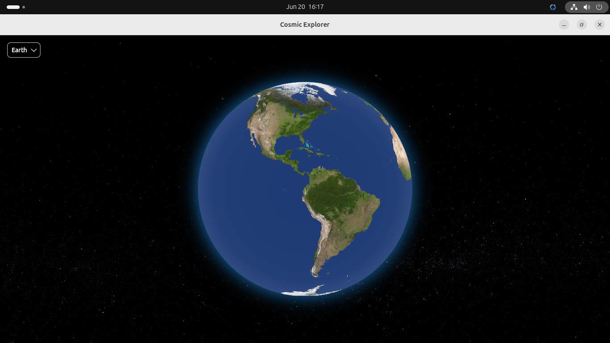

# 🌌 Cosmic Explorer

**Cosmic Explorer** is a cross-platform Flutter application that allows users to explore planets in the solar system through interactive 3D visualizations.

This app brings planetary data to life with engaging visuals, a modern interface, and an educational focus. Ideal for astronomy enthusiasts, students, and curious minds.

---

## 🚀 Features

- 🌍 Interactive 3D planetary globe using Flutter Earth Globe

---

## 📸 Preview

### Screenshot



### Demo Video

https://github.com/romavicdosanjos/cosmic_explorer/video.webm

Or open locally:

<video width="600" controls>
  <source src="video.webm" type="video/webm">
  Your browser does not support the video tag.
</video>

---

## 🛠️ Getting Started

Make sure you have [Flutter](https://flutter.dev/docs/get-started/install) installed on your system.

### Clone the repository:

```bash
git clone https://github.com/romavicdosanjos/cosmic_explorer.git
cd cosmic_explorer
