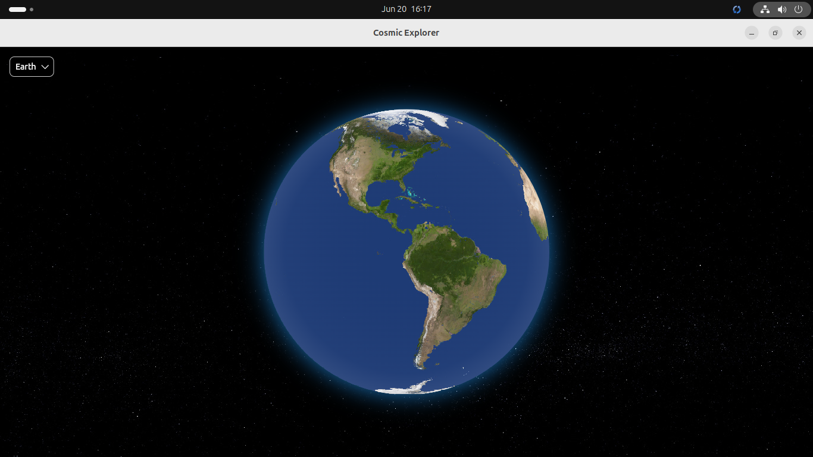

# 🌌 Cosmic Explorer

[](https://flutter.dev)
[](https://dart.dev)
[](https://www.gnu.org/licenses/gpl-3.0)
[](https://ubuntu.com)

**Cosmic Explorer** is a modern cross-platform Flutter application that brings the solar system to life through interactive 3D visualizations, detailed astronomical data, and a native desktop UI experience.

Ideal for astronomy enthusiasts, students, educators, and curious minds.

---

## 📸 Preview



### 🎞️ Demo Video
🎥 [**Watch Demo Video**](https://github.com/user-attachments/assets/d7bfd510-a9f9-4c16-81ba-ae3fb0ca4a3c)

---

## 🚀 Key Features

* 🌍 **Interactive 3D Globe:** High-fidelity 3D planet rendering and rotation powered by `flutter_earth_globe`.
* 📴 **Offline-First Architecture:** Local data persistence backed by `Drift` (SQLite), ensuring seamless exploration even without an internet connection.
* 🔄 **Smart Remote Sync:** Fetches and updates planetary data from [The Solar System OpenData API](https://api.le-systeme-solaire.net/) when online.
* ⚙️ **Reactive State Management:** Predictable, high-performance state handling powered by `MobX` and dependency injection via `get_it`.
* 🧭 **Native Desktop Integration:** Styled with the Canonical `yaru` design system, providing a native look and feel on Ubuntu and Linux desktops.
* 📦 **Snapcraft Ready:** Preconfigured for packaging and distribution as an Ubuntu Snap package.

---

## 🛠️ Tech Stack & Packages

| Category | Technology / Package | Description |
| :--- | :--- | :--- |
| **Framework** | [Flutter](https://flutter.dev/) | Cross-platform UI toolkit |
| **Language** | [Dart](https://dart.dev/) | Client-optimized language |
| **Design System** | [`yaru`](https://pub.dev/packages/yaru) | Ubuntu desktop theme and UI components |
| **3D Rendering** | [`flutter_earth_globe`](https://pub.dev/packages/flutter_earth_globe) | Interactive 3D planetary spheres and textures |
| **State Management** | [`mobx`](https://pub.dev/packages/mobx) & [`flutter_mobx`](https://pub.dev/packages/flutter_mobx) | Transparent Functional Reactive Programming (TFRP) |
| **Local Database** | [`drift`](https://pub.dev/packages/drift) & [`drift_flutter`](https://pub.dev/packages/drift_flutter) | Type-safe reactive SQLite persistence |
| **Dependency Injection** | [`get_it`](https://pub.dev/packages/get_it) | Service locator for clean decoupling |
| **Networking** | [`http`](https://pub.dev/packages/http) | REST API client for remote synchronization |

---

## 🏗️ Architecture & Project Structure

The project follows the principles of **Clean Architecture** with a feature-driven modular structure:

```text
lib/
├── core/
│   └── services/
│       ├── api/              # API interface and HTTP implementation
│       └── database/         # Drift SQLite database & table definitions
├── di/                       # Global Dependency Injection container setup
├── features/
│   └── planets/
│       ├── data/             # Data sources, DTOs & repository implementations
│       ├── di/               # Feature-specific dependency injection
│       ├── domain/           # Entities, repository interfaces & use cases
│       └── presentation/     # UI screens, widgets & MobX stores
├── helpers/                  # General helper functions and utilities
└── main.dart                 # Application entry point & theme initialization
```

---

## 🏁 Getting Started

### Prerequisites

- [Flutter SDK](https://docs.flutter.dev/get-started/install) (version `>=3.8.1`)
- For Linux desktop builds: standard build tools (`clang`, `cmake`, `ninja-build`, `pkg-config`, `libgtk-3-dev`)

### Installation & Setup

1. **Clone the repository:**
   ```bash
   git clone https://github.com/romavicdosanjos/cosmic_explorer.git
   cd cosmic_explorer
   ```

2. **Install Flutter dependencies:**
   ```bash
   flutter pub get
   ```

3. **🔑 Obtain and Configure API Key (The Solar System OpenData):**
   This application consumes data from [The Solar System OpenData API](https://api.le-systeme-solaire.net/), which requires a free API Key (Bearer token).
   
   - **Generate Key:** Request your free API key at [**api.le-systeme-solaire.net/generatekey.html**](https://api.le-systeme-solaire.net/generatekey.html).
   - **Configure Key:** Insert or update your Bearer token in [`lib/features/planets/data/data_source/planets_data_source_impl.dart`](file:///home/romavicdosanjos/Projects/cosmic_explorer/lib/features/planets/data/data_source/planets_data_source_impl.dart#L17):
     ```dart
     headers: {
       'Authorization': 'Bearer YOUR_API_KEY_HERE',
     },
     ```

4. **Run code generation:**
   Generate MobX stores and Drift database schemas:
   ```bash
   dart run build_runner build --delete-conflicting-outputs
   ```

5. **Run the application:**
   ```bash
   # Run on Linux Desktop
   flutter run -d linux

   # Or run with default target
   flutter run
   ```

---

## 📦 Building Snap Package (Linux)

To build the Snap package for Ubuntu:

```bash
# Build the release bundle first
flutter build linux --release

# Build snap using snapcraft
snapcraft
```

---

## 📡 Data Sources & Attribution

- **Planetary Data:** Provided by [The Solar System OpenData API](https://api.le-systeme-solaire.net/) (Generate free API key: [link](https://api.le-systeme-solaire.net/generatekey.html)).
- **Planet Textures:** Public domain planetary maps and celestial background textures.

---

## 📄 License

This project is licensed under the [GNU General Public License v3.0](https://www.gnu.org/licenses/gpl-3.0).

